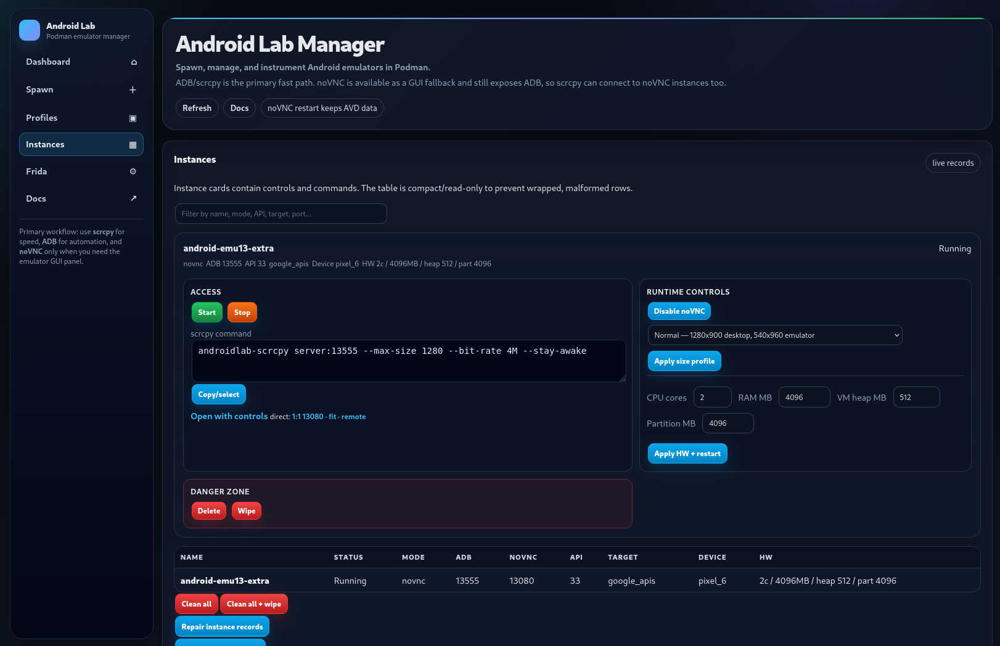
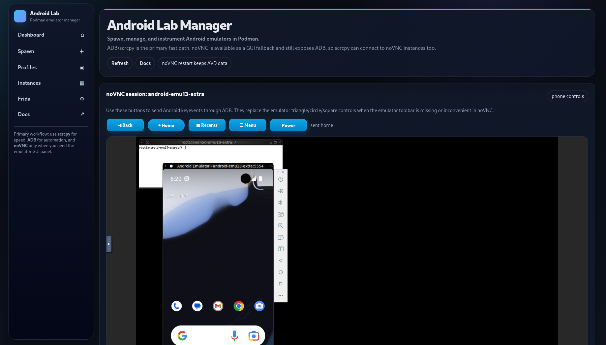

# Android Podman Lab Web Manager

Podman-based Android emulator lab manager.

- designed for Rocky Linux, but easily adaptable to any distro
- can be spawned on the server as a remote instance
- supports emulator GUI with noVNC via HTML, scrcpy
- uses Podman and systemctl --user for emulator control
- still in progress, but it works
- adb over TCP

Primary workflow:

- Use `scrcpy` for fast screen/control from the client.
- Use raw `adb` from the client/workstation for automation.
- Use noVNC only as a fallback when the full emulator GUI/panel is needed.




## Release


## Install or update

```bash
mkdir -p "$HOME/AndroidLab"
tar -xzf android-podman-lab-web-manager-spawn.tar.gz -C "$HOME/AndroidLab"
cd "$HOME/AndroidLab/android-podman-lab-web-manager-spawn"

./web-install.sh \
  --api 33 \
  --target google_apis \
  --host 0.0.0.0 \
  --port 18080 \
  --public-host SERVER_INTERNAL_IP \
  --token 'change-me'
```

After update:

```bash
cd "$HOME/AndroidLab/android-podman-lab"

scripts/clean-stale-files.sh
./androidlab.sh discover-running
./androidlab.sh repair-records
scripts/regression-test.sh
systemctl --user restart androidlab-manager.service
```

## Manager service

```bash
systemctl --user start androidlab-manager.service
systemctl --user restart androidlab-manager.service
systemctl --user status androidlab-manager.service
journalctl --user -u androidlab-manager.service -f
```

## Emulator instances

```bash
./androidlab.sh spawn NAME headless 33 google_apis pixel
./androidlab.sh spawn NAME novnc 33 google_apis pixel
./androidlab.sh start NAME
./androidlab.sh stop NAME
./androidlab.sh state NAME
```

## Client ADB

Run raw `adb` on the client/workstation and connect to the server-published ADB port from the manager instance card.

```bash
adb connect SERVER_INTERNAL_IP:13555
adb devices -l
adb -s SERVER_INTERNAL_IP:13555 shell getprop ro.product.model
```

## Documentation

The `docs/` directory contains help file: ADB, scrcpy, Frida, noVNC, lifecycle, service, API/device selection, cleanup, and maintenance commands.
